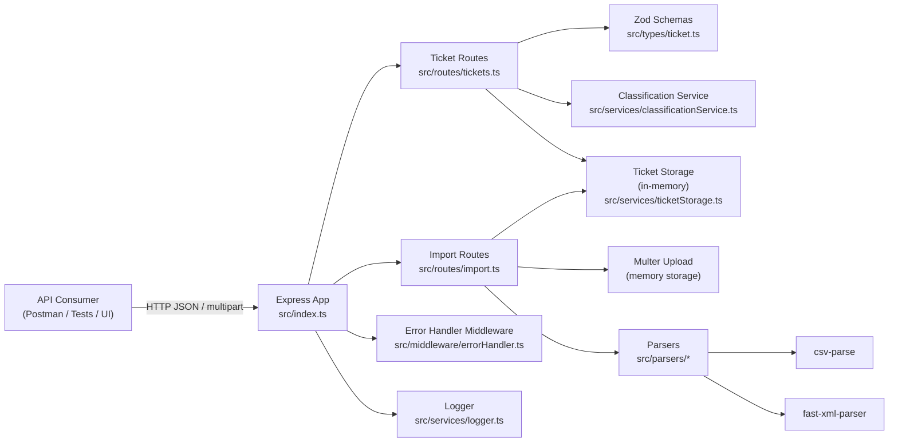

# 🎫 Intelligent Customer Support System

> **Student Name**: Denys Usenko
> **Date Submitted**: February 2, 2026
> **AI Tools Used**: GitHub Copilot

---

## 📋 Project Overview

Customer support ticket management API built with **Node.js + Express + TypeScript**. It supports **multi-format bulk import** (CSV/JSON/XML), **automatic ticket classification** (category + priority), filtering, and a comprehensive Jest test suite with coverage thresholds.

## Table of Contents

- [Features](#features)
- [Documentation](#documentation)
- [Architecture](#architecture-high-level)
- [Installation & Setup](#installation--setup)
- [How to Run Tests](#how-to-run-tests)
- [Project Structure](#project-structure)

---

## Features

- **Ticket CRUD API**: create, list (with filtering), read, update, delete
- **Bulk import**: upload **CSV / JSON / XML** via multipart form-data
- **Validation**: strong input validation using **Zod** (enums, lengths, email format)
- **Auto-classification**: detects **category**, **priority**, **confidence**, and **keywords**
- **Observability**: structured logging via **Winston**
- **Testing & coverage**: Jest + ts-jest with **85% global coverage thresholds**

## Documentation

📖 **Comprehensive Documentation:**

- **[API Reference](docs/API_REFERENCE.md)** - Complete API endpoints, schemas, and examples
- **[Architecture](docs/ARCHITECTURE.md)** - System components, data flows, and design decisions
- **[Testing Guide](docs/TESTING_GUIDE.md)** - How to run tests, fixtures, and manual QA checklist

## Architecture (High Level)



---

## Installation & Setup

### Prerequisites

- **Node.js 18+** (Node 20/22 recommended)
- **npm** (ships with Node)

### Installation

From the repository root:

```bash
cd AI-Coding-Partner-Homework/homework-2
npm install
```

### Run Locally

**Development Mode** (with auto-reload):

```bash
npm run dev
```

**Production Mode**:

```bash
npm run build
npm start
```

### Configuration

| Environment Variable | Default | Description |
|---------------------|---------|-------------|
| `PORT` | `3000` | Server port |

**Health Check:**

```bash
curl http://localhost:3000/health
```

---

## How to Run Tests

**Full Test Suite** (with coverage):

```bash
npm test
```

**Watch Mode**:

```bash
npm run test:watch
```

**Load Test** (concurrent requests):

```bash
npm run test:load
```

### Test Coverage

- Coverage reports are generated in `coverage/`
- **Global threshold**: 85% (branches, functions, lines, statements)
- View HTML report: `open coverage/lcov-report/index.html`

---

## Project Structure

```text
homework-2/
  src/
    index.ts                # Express app entrypoint
    routes/                 # HTTP routes (/tickets, /tickets/import)
    parsers/                # CSV/JSON/XML parsing utilities
    services/               # storage, classification, logging
    middleware/             # error handling
    types/                  # zod schemas + shared types
  tests/
    *.test.ts               # Jest test suite
    fixtures/               # sample/invalid import files
    load/                   # load/concurrency script(s)
  postman/                  # Postman collection + environment
  coverage/                 # generated by tests (do not edit)
  package.json
  jest.config.js
  tsconfig.json
```
