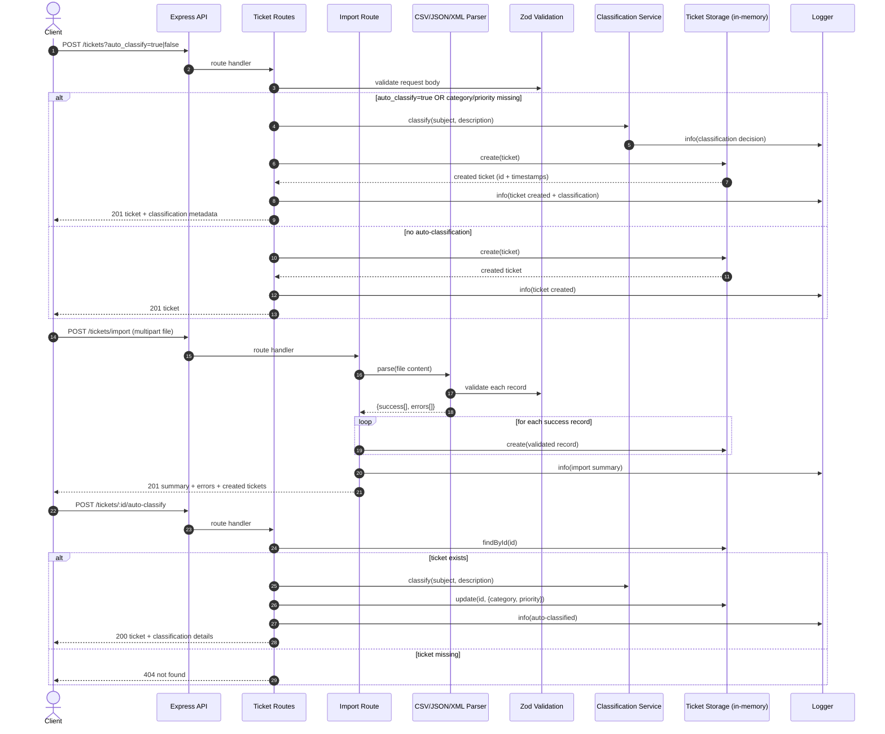

# Architecture (Technical Leads)

## Goals

- Provide a simple, reliable REST API to manage support tickets.
- Support bulk imports from CSV/JSON/XML with per-record validation and clear error reporting.
- Automatically classify tickets (category + priority) using deterministic, explainable rules.

Non-goals (current version): persistent storage, authentication/authorization, and async/background processing.

## High-Level Architecture

```mermaid
graph TD
  subgraph Clients
    A[API Consumer\n(Postman / UI / Integration)]
  end

  subgraph API[Node.js + Express API]
    B[Express App\nsrc/index.ts]
    C[Routes\n/tickets, /tickets/import]
    D[Middleware\nCORS + JSON body + Error Handler]
  end

  subgraph Domain[Core Components]
    E[Ticket Validation\nZod Schemas]
    F[Ticket Storage\nIn-memory Map]
    G[Classification Service\nKeyword rules + confidence]
    H[Parsers\nCSV / JSON / XML]
    I[Logger\nWinston to logs/]
  end

  A -->|HTTP| B
  B --> D
  B --> C

  C -->|create/update/list| F
  C -->|validate input| E
  C -->|auto-classify| G
  C -->|import file| H

  H -->|validate records| E
  H -->|valid records| F

  G --> I
  C --> I
  D --> I
```

## Component Responsibilities

| Component | Location | Primary responsibility |
|---|---|---|
| Express app | src/index.ts | Wires middleware, routes, and global error handling; exposes `/health`. |
| Ticket routes | src/routes/tickets.ts | CRUD endpoints for tickets + `/tickets/:id/auto-classify`. |
| Import route | src/routes/import.ts | File upload endpoint; selects parser by extension; creates tickets from valid records; returns import summary. |
| Validation | src/types/ticket.ts | Centralized request/record validation (Zod) for tickets, enums, and metadata. |
| Storage | src/services/ticketStorage.ts | In-memory CRUD (Map) + basic filtering by category/priority/status. |
| Classification | src/services/classificationService.ts | Deterministic keyword-based category/priority assignment + confidence + reasoning + keywords found. |
| Parsers | src/parsers/* | Parse format-specific payload → normalized ticket shape → validate → return successes + errors. |
| Error handler | src/middleware/errorHandler.ts | Converts AppError/ZodError to consistent HTTP responses; handles 500s. |
| Logging | src/services/logger.ts | Structured logs to `logs/` with console output outside production and silenced during tests. |

## Runtime Data Flow (Key Request Paths)



## Design Decisions & Trade-offs

- In-memory storage (`Map`) vs database
  - Decision: keep storage in-memory for simplicity and testability.
  - Trade-off: data is lost on restart; no horizontal scaling without an external store.
  - Upgrade path: replace `ticketStorage` with a repository interface backed by Postgres/Redis; keep routes stable.

- Zod validation at the boundaries
  - Decision: validate API inputs and imported records using the same schemas.
  - Trade-off: strict validation may reject partially complete legacy imports (by design).

- Deterministic classification (keyword rules)
  - Decision: implement explainable, predictable classification with confidence + reasoning.
  - Trade-off: less accurate than ML/LLM approaches on ambiguous inputs.
  - Upgrade path: introduce an LLM/ML classifier behind the same `classificationService` interface, keep the response shape (category/priority/confidence/reasoning).

- File upload via memory buffer (multer)
  - Decision: accept imports as multipart uploads and parse in-memory.
  - Trade-off: bounded by memory; large files are constrained (current limit: 10MB).
  - Upgrade path: stream parsing + backpressure; store uploads in object storage; async import jobs.

- Centralized error handling
  - Decision: normalize known errors (AppError + ZodError) into consistent API responses.
  - Trade-off: consumers must rely on status codes + `error/details` payload; stack traces are not returned.

## Security Considerations

Current state is intentionally minimal; recommended controls are listed for production hardening.

- Input validation: all tickets and imported records are validated with Zod; malformed files return 400/201-with-errors summary rather than crashing.
- File upload safety:
  - 10MB upload limit is enforced.
  - Format detection is by filename extension; consider content sniffing for stronger validation.
- Logging & PII:
  - Tickets may contain emails/names; avoid logging raw ticket payloads.
  - Consider log redaction/masking for `customer_email` and any sensitive metadata.
- CORS:
  - CORS is enabled globally; for production, restrict allowed origins.
- Missing (recommended for production):
  - Authentication/authorization (API keys, OAuth, JWT).
  - Rate limiting and abuse protection.
  - Audit logging for changes (who changed what, when).
  - Dependency scanning and runtime hardening (helmet, strict transport security behind TLS).

## Performance Considerations

- Fast paths:
  - In-memory CRUD is O(1) for reads/writes by id; filter queries are O(n) over all tickets.
  - Classification is lightweight string matching over subject/description.
- Bulk import:
  - Parsing and validation run per-record; worst-case time scales linearly with number of records.
  - Current design returns created tickets in the response; for very large imports, consider returning only a summary.
- Logging:
  - Structured logging to disk is synchronous-ish via transports; in very high throughput scenarios, consider async transport/buffering.
- Scaling (future):
  - Introduce a persistent DB + indexes for filtering.
  - Add request concurrency controls and per-tenant quotas.
  - Move import processing to background jobs (queue) for large files.

## Related Documents

- API endpoints and examples: [API_REFERENCE.md](API_REFERENCE.md)
- Developer setup and project overview: [README.md](README.md)
