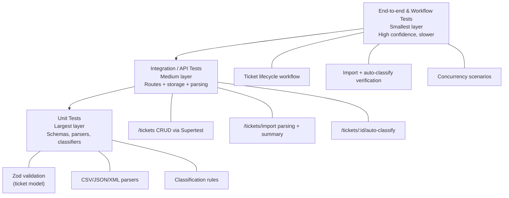

# Testing Guide (QA Engineers)

This guide explains how to run the automated test suite, where to find sample import files, what to manually verify in the API, and what performance expectations exist.

## Table of Contents

- [Test Pyramid](#test-pyramid)
- [How to Run Tests](#how-to-run-tests)
- [Sample Test Data Locations](#sample-test-data-locations)
- [Manual Testing Checklist](#manual-testing-checklist)
- [Performance Benchmarks](#performance-benchmarks)

---

## Test Pyramid



---

## How to Run Tests

### Prerequisites

- **Node.js 18+** (Node 20/22 recommended)
- Dependencies installed: `npm install`

### Run the Full Suite (with Coverage)

```bash
npm test
```

**Output:**
- Produces a coverage report under `coverage/`
- Enforces global coverage thresholds (85% branches/functions/lines/statements) via Jest config

### Run tests in watch mode

```bash
npm run test:watch
```

### Run a single test file

```bash
npx jest tests/ticket_api.test.ts
```

### Run a single test by name

```bash
npx jest -t "Performance Tests"
```

### Run “all” checks (unit/integration + load)

```bash
npm run test:all
```

---

## Sample Test Data Locations

### Import Fixtures (Automated Tests)

**Valid Samples:**
- [`tests/fixtures/valid_tickets.csv`](../tests/fixtures/valid_tickets.csv)
- [`tests/fixtures/valid_tickets.json`](../tests/fixtures/valid_tickets.json)
- [`tests/fixtures/valid_tickets.xml`](../tests/fixtures/valid_tickets.xml)

**Invalid Samples** (schema/field errors):
- [`tests/fixtures/invalid_tickets.csv`](../tests/fixtures/invalid_tickets.csv)
- [`tests/fixtures/invalid_tickets.json`](../tests/fixtures/invalid_tickets.json)
- [`tests/fixtures/invalid_tickets.xml`](../tests/fixtures/invalid_tickets.xml)

**Malformed Samples** (parse errors):
- [`tests/fixtures/malformed.csv`](../tests/fixtures/malformed.csv)
- [`tests/fixtures/malformed.json`](../tests/fixtures/malformed.json)
- [`tests/fixtures/malformed.xml`](../tests/fixtures/malformed.xml)

### Postman Collection (Optional Manual Testing)

- [`postman/support-system.postman_collection.json`](../postman/support-system.postman_collection.json)
- [`postman/support-system.postman_environment.json`](../postman/support-system.postman_environment.json)
---
## Manual Testing Checklist

Use this checklist for quick API sanity checks outside of Jest.

### 🚀 Setup

**1. Start the API:**

```bash
npm run dev
```

**2. Confirm service is up:**

```bash
curl http://localhost:3000/health
```

*Expected*: HTTP `200`

### 🎫 Ticket CRUD

- ☐ **Create ticket** (`POST /tickets`)
  - *Expected*: HTTP `201`, response includes `id`, `created_at`, `updated_at`
- ☐ **Read ticket** (`GET /tickets/:id`)
  - *Expected*: HTTP `200` and correct persisted values
- ☐ **Update ticket** (`PUT /tickets/:id`)
  - Update `status` (e.g., `in_progress`) and verify `updated_at` changes
- ☐ **Delete ticket** (`DELETE /tickets/:id`)
  - *Expected*: HTTP `204`
  - Follow-up `GET /tickets/:id` should return HTTP `404`

### ✅ Validation / Error Handling

- ☐ Send invalid email in `customer_email`
  - *Expected*: HTTP `400` with validation details
- ☐ Send too-short `description` (< 10 chars)
  - *Expected*: HTTP `400`
- ☐ Send invalid enums (e.g., `priority: "super-high"`)
  - *Expected*: HTTP `400`
- ☐ Request a non-existing ID
  - *Expected*: HTTP `404`

### 🔍 Filtering

- ☐ Create multiple tickets across different categories/priorities
- ☐ List tickets with filtering (`GET /tickets?category=technical_issue&priority=high`)
  - *Expected*: HTTP `200`, `total` matches and items satisfy filters

### 📂 Bulk Import (CSV/JSON/XML)

- ☐ Import a valid file via `POST /tickets/import` (multipart form-data)
  - *Expected*: HTTP `201` with summary: `total`, `successful`, `failed` and per-record errors
- ☐ Import invalid data (schema errors)
  - *Expected*: HTTP `201` summary shows failures with clear reasons
- ☐ Import malformed data (broken CSV/JSON/XML)
  - *Expected*: HTTP `400` with a meaningful parse error message

### 🤖 Auto-classification

- ☐ Create a ticket with classification keywords in the text (e.g., "can't access", "critical", "refund")
- ☐ Call `POST /tickets/:id/auto-classify`
  - *Expected*: HTTP `200` and response includes:
    - `category`, `priority`
    - `confidence` (0..1)
    - `reasoning`, `keywords`
- ☐ Verify the stored ticket reflects classification output

---

## Performance Benchmarks

These benchmarks are encoded in the automated tests. Use them as **regression guards** (if they fail, treat it as a performance regression or a noisy environment).

| Benchmark | Test File | How to Run | Pass Criteria | Notes |
|-----------|-----------|------------|---------------|-------|
| **Create 100 tickets** | `tests/performance.test.ts` | `npx jest tests/performance.test.ts` | < 5s total | Runs in-process via Supertest |
| **Filtered list latency** | `tests/performance.test.ts` | `npx jest tests/performance.test.ts` | < 100ms | `GET /tickets?category=...` |
| **Rapid updates** | `tests/performance.test.ts` | `npx jest tests/performance.test.ts` | < 1s total | 20 concurrent `PUT` requests |
| **List 200 tickets** | `tests/performance.test.ts` | `npx jest tests/performance.test.ts` | < 200ms | Validates response `total = 200` |
| **Load test (autocannon)** | `tests/load/concurrent.load.ts` | `npm run test:load` | p99 < 200ms (20 conns), 0 errors | Writes logs under `logs/` |

### Load Test Options

```bash
npm run test:load -- --duration=15
```

> 💡 **Note**: If a benchmark is flaky on CI or a slower laptop, rerun once and compare results in the generated load-test log file.
