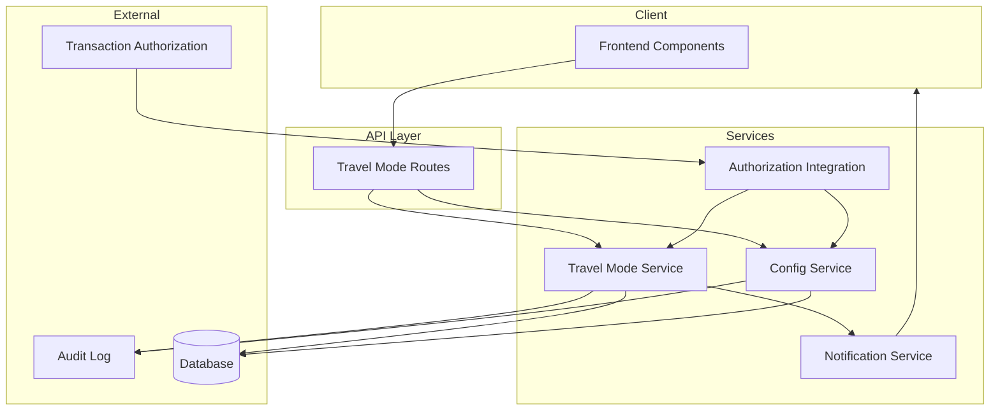

# Travel Mode Specification

> Ingest the information from this file, implement the Low-Level Tasks, and generate the code that will satisfy the High and Mid-Level Objectives.

## High-Level Objective

- Build a self-service Travel Mode feature that allows cardholders to temporarily enable international transactions for selected countries with flexible time options, ensuring full auditability and compliance with financial regulations.

## Mid-Level Objectives

- Enable cardholders to create, update, and delete Travel Mode entries specifying countries and time ranges
- Support three time range variants: date range, date+time+timezone, and "until turned off"
- Integrate Travel Mode status checks into the transaction authorization flow
- Provide configurable default international transaction policies at company and card levels
- Send notifications for activation, deactivation, admin alerts, and blocked transactions
- Maintain complete audit trail of all Travel Mode changes for compliance
- Auto-expire Travel Mode entries after their end date/time

## Implementation Notes

### Data Handling
- Store all timestamps in UTC; convert to user's timezone for display
- Use ISO 3166-1 alpha-2 country codes for country identification
- Travel dates reveal cardholder location—treat as PII with appropriate access controls
- Implement soft-delete for Travel Mode records to preserve audit history

### Security Requirements
- All API endpoints require authentication and authorization
- Rate limit Travel Mode creation to prevent abuse
- Log all state changes with actor, timestamp, and before/after values
- Encrypt sensitive data at rest and in transit

### Compliance Requirements
- Full audit trail: who changed what, when, from what value to what value
- Retain Travel Mode history for regulatory retention period (7 years minimum)
- Support compliance team read-only access to Travel Mode history
- Generate compliance reports on Travel Mode usage patterns

### Performance Requirements
- Travel Mode lookup during authorization must complete in <50ms
- Support bulk Travel Mode queries for admin dashboards
- Cache active Travel Mode entries for frequently used cards

### Testing Requirements
- Unit tests for timezone conversion logic
- Unit tests for time range overlap detection
- Integration tests for authorization flow with Travel Mode
- Edge case tests for midnight crossings, DST transitions, leap years

## Architecture

## Context

### Beginning Context
- Existing card management system with card and company entities
- Transaction authorization service that processes card transactions
- Notification service for sending alerts to cardholders
- User authentication and authorization infrastructure
- Audit logging framework

### Ending Context
- `src/types/travel-mode.ts` — Type definitions for Travel Mode entities
- `src/services/travel-mode-service.ts` — Core Travel Mode business logic
- `src/services/authorization-integration.ts` — Authorization hook implementation
- `src/services/company-card-config-service.ts` — Default policy configuration
- `src/services/travel-mode-notification-service.ts` — Notification handling
- `src/routes/travel-mode-routes.ts` — API endpoint definitions
- `src/components/travel-mode/` — Frontend component directory
- `tests/travel-mode/` — Test suite directory
- Updated audit log schema to capture Travel Mode events
- API documentation for Travel Mode endpoints

## Low-Level Tasks

### 1. Define Type System

**What prompt would you run to complete this task?**
Create TypeScript type definitions for the Travel Mode feature including the main TravelMode entity, TimeRange variants (date-only, date-time-timezone, indefinite), Country enum using ISO 3166-1 alpha-2 codes, and NotificationType enum.

**What file do you want to CREATE or UPDATE?**
`src/types/travel-mode.ts`

**What function do you want to CREATE or UPDATE?**
Type definitions: `TravelMode`, `TimeRangeType`, `DateRange`, `DateTimeRange`, `IndefiniteRange`, `Country`, `NotificationType`, `TravelModeStatus`, `TravelModeAuditEntry`

**What are details you want to add to drive the code changes?**
- TravelMode must include: id, cardId, userId, countries (array), timeRange, status, createdAt, updatedAt, createdBy
- TimeRange must be a discriminated union supporting three variants
- Include validation helper types for country arrays (min 1, max 50 countries)
- NotificationType: ACTIVATION, DEACTIVATION, ADMIN_ALERT, BLOCKED_TRANSACTION, EXPIRATION_WARNING
- TravelModeStatus: ACTIVE, EXPIRED, CANCELLED, SCHEDULED

---

### 2. Implement Travel Mode Service

**What prompt would you run to complete this task?**
Create the core Travel Mode service with methods to create, update, delete, list active modes, and check if a specific country is allowed for a card at a given timestamp.

**What file do you want to CREATE or UPDATE?**
`src/services/travel-mode-service.ts`

**What function do you want to CREATE or UPDATE?**
`TravelModeService` class with methods: `create()`, `update()`, `delete()`, `listActive()`, `listByCard()`, `isCountryAllowed()`, `getActiveForCard()`

**What are details you want to add to drive the code changes?**
- `create()` validates no overlapping time ranges for same countries
- `update()` only allowed for SCHEDULED or ACTIVE modes; log previous values
- `delete()` performs soft-delete, sets status to CANCELLED
- `isCountryAllowed()` checks both Travel Mode and default company/card policy
- All mutations must create audit log entries
- Handle timezone conversion for time-based ranges
- Implement auto-expiration check on read operations

---

### 3. Authorization Integration

**What prompt would you run to complete this task?**
Create an authorization integration hook that checks Travel Mode status during transaction authorization, determining whether an international transaction should be allowed based on merchant country and current time.

**What file do you want to CREATE or UPDATE?**
`src/services/authorization-integration.ts`

**What function do you want to CREATE or UPDATE?**
`AuthorizationHook` class with methods: `checkTravelMode()`, `shouldAllowInternationalTransaction()`, `getBlockReason()`

**What are details you want to add to drive the code changes?**
- Receive card ID, merchant country code, and transaction timestamp
- First check if card has active Travel Mode covering the country and time
- If no Travel Mode, fall back to default company/card international policy
- Return allow/deny decision with reason code for audit
- Performance: must complete check in <50ms
- Log all authorization decisions with Travel Mode context
- Trigger BLOCKED_TRANSACTION notification if denied due to Travel Mode

---

### 4. Company and Card Configuration Service

**What prompt would you run to complete this task?**
Create a configuration service to manage default international transaction policies at company and card levels, with card-level settings overriding company defaults.

**What file do you want to CREATE or UPDATE?**
`src/services/company-card-config-service.ts`

**What function do you want to CREATE or UPDATE?**
`ConfigService` class with methods: `getCompanyPolicy()`, `setCompanyPolicy()`, `getCardPolicy()`, `setCardPolicy()`, `getEffectivePolicy()`

**What are details you want to add to drive the code changes?**
- Company policy: default allow/deny international, allowed country list
- Card policy: override flag, custom allow/deny, custom country list
- `getEffectivePolicy()` merges company and card policies with proper precedence
- All policy changes create audit log entries
- Support bulk policy updates for compliance scenarios
- Include policy validation (e.g., country codes must be valid)

---

### 5. Notification Service

**What prompt would you run to complete this task?**
Create a notification service that handles all Travel Mode notification types with appropriate templates and delivery channels.

**What file do you want to CREATE or UPDATE?**
`src/services/travel-mode-notification-service.ts`

**What function do you want to CREATE or UPDATE?**
`TravelModeNotificationService` class with methods: `sendActivation()`, `sendDeactivation()`, `sendAdminAlert()`, `sendBlockedTransaction()`, `sendExpirationWarning()`, `scheduleExpirationReminder()`

**What are details you want to add to drive the code changes?**
- Each notification type has its own template with Travel Mode details
- Support multiple delivery channels: push, email, SMS based on user preferences
- Admin alerts go to configured compliance/ops team members
- Blocked transaction alerts include merchant info and guidance to enable Travel Mode
- Expiration warnings sent 24 hours before Travel Mode ends
- Include unsubscribe/preference management links
- Log all notification sends for audit

---

### 6. API Endpoints

**What prompt would you run to complete this task?**
Create RESTful API endpoints for Travel Mode CRUD operations and configuration management with proper authentication, authorization, validation, and error handling.

**What file do you want to CREATE or UPDATE?**
`src/routes/travel-mode-routes.ts`

**What function do you want to CREATE or UPDATE?**
Route handlers: `POST /travel-modes`, `GET /travel-modes`, `GET /travel-modes/:id`, `PUT /travel-modes/:id`, `DELETE /travel-modes/:id`, `GET /cards/:cardId/travel-modes`, `GET /config/company/:companyId`, `PUT /config/company/:companyId`, `GET /config/cards/:cardId`, `PUT /config/cards/:cardId`

**What are details you want to add to drive the code changes?**
- All endpoints require authentication; user can only access own cards
- Admin/compliance roles can access any card's Travel Mode history
- Input validation for country codes, date ranges, timezone identifiers
- Proper HTTP status codes: 201 created, 400 validation error, 403 forbidden, 404 not found
- Rate limiting: max 10 Travel Mode creates per card per day
- Include OpenAPI/Swagger documentation annotations
- Return audit-friendly response bodies with request IDs

---

### 7. Frontend Components

**What prompt would you run to complete this task?**
Create frontend components for the Travel Mode user interface including country picker, date/time selector with timezone support, and active trips view.

**What file do you want to CREATE or UPDATE?**
`src/components/travel-mode/` directory with `CountryPicker.tsx`, `DateTimeSelector.tsx`, `ActiveTripsView.tsx`, `TravelModeForm.tsx`

**What function do you want to CREATE or UPDATE?**
Components: `CountryPicker`, `DateTimeSelector`, `ActiveTripsView`, `TravelModeForm`, `TravelModeCard`

**What are details you want to add to drive the code changes?**
- CountryPicker: searchable multi-select with country flags, grouped by region
- DateTimeSelector: supports all three time range types with clear UX for each
- ActiveTripsView: list of current and upcoming Travel Modes with edit/delete actions
- Display times in user's local timezone with timezone indicator
- Show clear status indicators: active (green), scheduled (blue), expired (gray)
- Accessibility: keyboard navigation, screen reader support
- Mobile-responsive design

---

### 8. Testing Suite

**What prompt would you run to complete this task?**
Create comprehensive test suites covering Travel Mode business logic, timezone handling, country matching, and edge cases.

**What file do you want to CREATE or UPDATE?**
`tests/travel-mode/` directory with `travel-mode-service.test.ts`, `authorization.test.ts`, `timezone.test.ts`, `edge-cases.test.ts`

**What function do you want to CREATE or UPDATE?**
Test suites: `TravelModeServiceTests`, `AuthorizationTests`, `TimezoneTests`, `EdgeCaseTests`

**What are details you want to add to drive the code changes?**
- Service tests: CRUD operations, validation, audit logging
- Authorization tests: allow/deny decisions, fallback to default policy
- Timezone tests: UTC conversion, DST transitions, timezone boundary cases
- Edge cases: midnight crossings, leap years, overlapping ranges, max countries
- Mock external dependencies (notification service, database)
- Test data fixtures for common scenarios
- Performance benchmarks for authorization lookups
